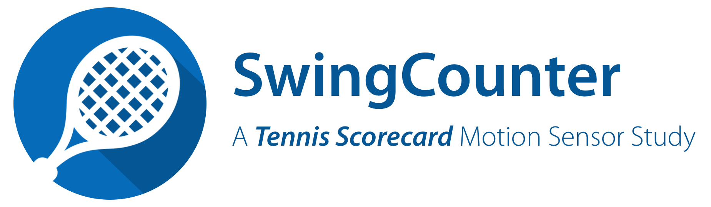
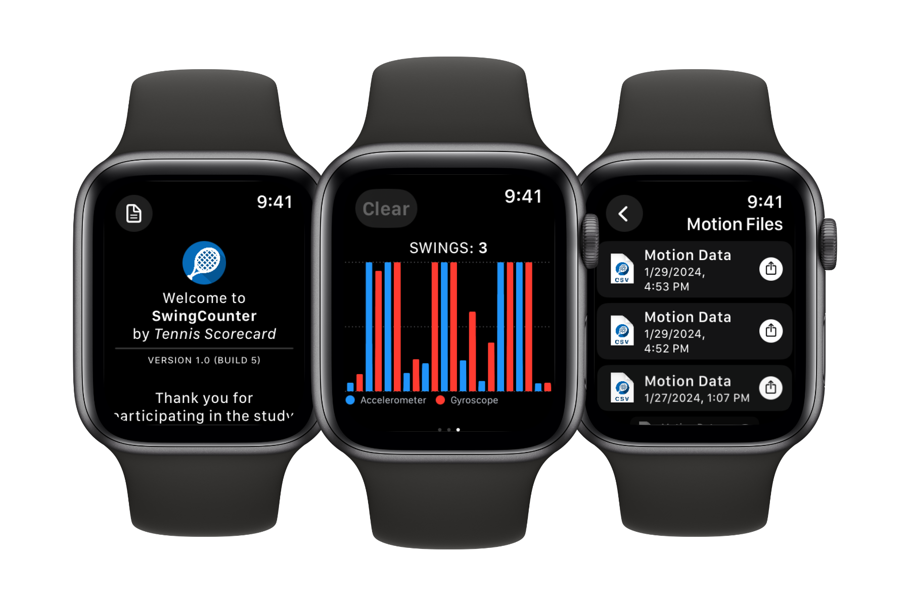

<!-- PROJECT LOGO -->
 

  <picture>
    <source media="(prefers-color-scheme: dark)" srcset="./Resources/swing_study_title_darkmode.png">
    <source media="(prefers-color-scheme: light)" srcset="./Resources/swing_study_title.png">
    
  </picture>

<!-- WATCH GRAPHIC -->

## Overview

*SwingCounter* is an ongoing research study by *[Tennis Scorecard](https://tennisscorecard.app)*. The objective of this study is to collect device motion sensor data during tennis matches. Accelerometer and gyroscope data are collected using a custom-built *SwingCounter* study app on Apple Watch. This app utilizes Apple's Core Motion framework to collect motion data.

The findings of this study are used to train and validate a machine learning model. Build 6 of the *SwingCounter* app includes a pre-trained classification model that was trained using the study's pilot data. This model analyzes motion data in real time and displays the detected swing count to the user.

## Data Collection App

**DEVICE REQUIREMENTS**

Requires an Apple Watch running watchOS 10.2 or higher.

**APP AVAILABILITY**

The SwingCounter app is available for participants to download from [TestFlight](https://testflight.apple.com/join/WCoinwV5).  

## Instructions For Participants

1. Download the SwingCounter app from TestFlight on your iPhone.
2. Open the app on your Apple Watch and tap "GO" to start a session.
3. Tap "Start" to begin the data collection. Tapping "Pause/Resume" toggles the collection of motion data.
4. During a session, swipe left to view the live graph and swing counter. The graph shows the previous 10 seconds of data.
5. Swipe right and tap "Teardown" to end the session.
6. The session data is stored locally on the watch in a CSV file. Tap the *File* icon on the Start Screen to view and share motion data files.
7. Email motion data files to [sendmichaelmail@icloud.com](mailto:sendmichaelmail@icloud.com) after completing a session.
